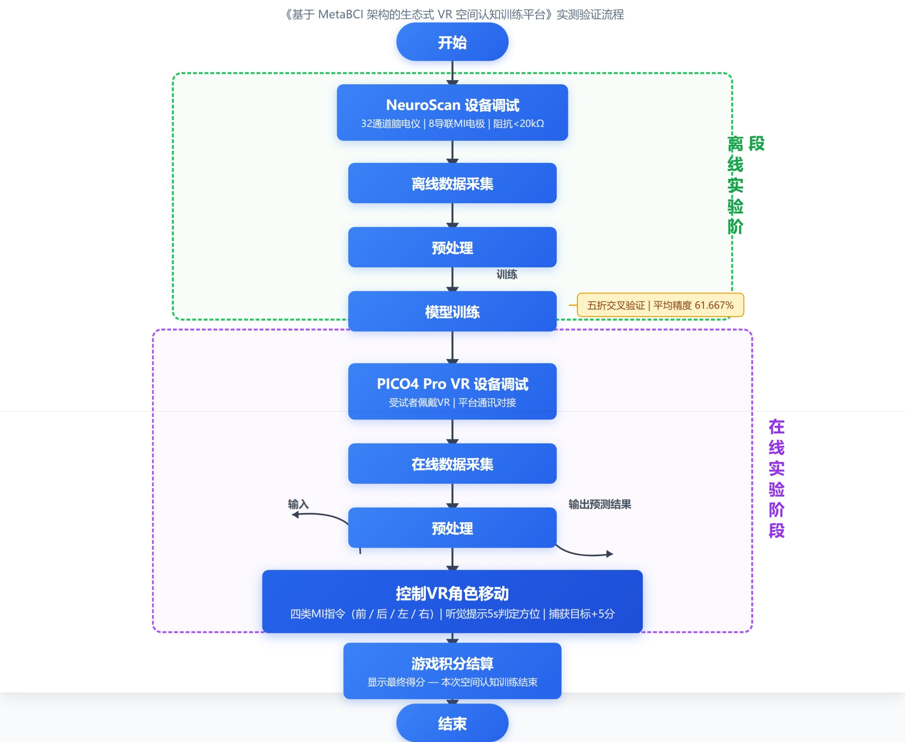

# MetaBCI-USTB-2026

## Welcome!
该工程为世界机器人大赛-BCI脑控机器人大赛 MetaBCI 创新应用开发赛项的代码。

## Basic information！
项目名称：基于 MetaBCI 架构的生态式 VR 空间认知训练平台

队伍单位：北京科技大学

参赛人员：杨思雨 孙宏晨 傅岸峰 邵文乐 韩晓珊 梁光金

所属赛道：主动控制赛道

## Project Introduction！
本项目面向空间认知能力训练与脑机接口主动控制应用，基于 MetaBCI 架构搭建生态式 VR 空间认知训练平台。系统以四分类运动想象（MI）脑电识别为核心，将受试者的运动想象脑电信号解码为前、后、左、右四类方位控制指令，并通过 Socket 通讯驱动 VR 交互训练游戏中的虚拟角色完成移动与目标捕获任务。

本次线上演示将开展平台实测验证。实验配套采集硬件选用 NeuroScan 32 通道脑电仪，其中专门划分 8 个导联电极用于运动想象信号采集，全部导联电极阻抗统一调试至 20 千欧以内，以保障脑电原始采集数据具备较高信噪比。实时波形画面显示，整套采集硬件工况稳定、信号传输无异常。

平台演示阶段，受试者佩戴 VR 设备并完成系统通讯对接。前期离线数据集采用五折交叉验证方案测算，模型平均识别精度为 61.667%。在线实操过程中，受试者依据 5 秒内播放的听觉提示判断目标生物所在方位，同步输出对应运动想象脑电信号操控虚拟角色位移；顺利捕获目标后，界面左上角积分自动累加 5 分。整套训练流程融合了空间方位辨别、短期工作记忆与认知执行能力训练，可用于验证 BCI-VR 在空间认知训练场景中的交互闭环效果。

## Project technical path！
依托 MetaBCI 开源平台架构，本项目集成了运动想象范式呈现、脑电信号采集、离线模型训练、在线实时解码与 VR 外设交互控制流程，实现四指令 BCI-VR 空间认知训练系统。

* 在刺激呈现方面，调用 brainstim 子平台下新增的四分类 MI 范式，完成左手、右手、脚部、双手运动想象提示与反馈，并映射为 VR 场景中的左、右、后、前方位指令。
* 在数据集支持方面，新增 `USTB2026MI4C` 四分类运动想象数据集类，支持数据读取，并在本地数据不存在时通过 GitHub raw 地址自动下载示例数据。
* 在信号处理方面，对 brainda 子平台补充熵特征分析与可视化方法，用于辅助观察和分析脑电信号特征。
* 在信号解码方面，新增并适配 EEG-Conformer、EEG-TCNet、EEG-ATCNet、TCNet-Fusion 等深度学习模型，其中在线演示默认采用 EEG-Conformer 完成四分类运动想象识别。
* 在设备接入方面，支持 NeuroScan Curry LSL 数据流输入，并补充 OpenBCI GUI LSL 与 UDP marker 触发测试工具，便于不同采集硬件下进行联调验证。
* 在外设控制方面，对 brainflow 子平台新增在线指令输出流程，通过 Socket 协议将解码结果发送至 VR 训练游戏，控制虚拟角色完成移动、定位与抓捕任务。

项目技术路径图

## Code testing instructions！
建议在原有 MetaBCI 环境基础上安装项目依赖，新增依赖已在 `requirements.txt` 与 `pyproject.toml` 中体现，主要包括 `mne-bids`、`einops==0.8.1`、`pylsl`、`keyboard==0.13.5` 与 `psychopy>=2022.1.4`。

四分类 MI 示例数据已放置在 `demos/brainflow_demos/data` 目录下；同时 `USTB2026MI4C` 数据集类已支持在本地数据不存在时自动下载数据。

主要测试文件如下：

* `demos/brainstim_demos/stim_demo.py`：四分类 MI 刺激范式与 VR 训练入口配置示例。
* `demos/brainflow_demos/Offline_mi4c.py`：四分类 MI 离线验证 demo，默认加载 `USTB2026MI4C` 数据集并进行五折模型测试。
* `demos/brainflow_demos/Online_mi4c_new_lsl.py`：面向 NeuroScan Curry LSL 数据流的在线解码 demo。
* `demos/brainflow_demos/Online_mi4c_new_OpenBCI.py`：面向 OpenBCI GUI LSL 数据流的在线解码 demo。
* `demos/brainstim_demos/openbci_gui_trigger_test.py`：OpenBCI GUI UDP marker 通路测试脚本。

NeuroScan Curry LSL 在线测试流程：

* 确保脑电信号采集程序、在线解码程序与 VR 设备处于同一网络环境；
* 连接 NeuroScan 32 通道脑电设备，佩戴脑电帽并将用于运动想象采集的 8 个导联阻抗调试至 20 千欧以内；
* 在 Curry 软件中设置采样率为 256 Hz，启用必要的工频陷波与带通滤波，并开启 LSL 数据流输出；
* 确认 LSL 流名称与 `Online_mi4c_new_lsl.py` 中的 `LSL_EEG_STREAM_NAME` 配置一致，默认值为 `CURRYStream`；
* 运行 `Online_mi4c_new_lsl.py`，程序将先加载离线数据并输出五折交叉验证结果；
* 程序提示 `按空格键开始实时解码...` 后，由主试人员按空格进入正式在线解码；
* 受试者根据 VR 游戏中的听觉提示完成对应运动想象任务，系统实时输出前、后、左、右四类控制指令并驱动 VR 角色完成空间认知训练。

OpenBCI GUI 在线测试流程：

* 打开 OpenBCI GUI 并开启 EEG LSL 数据流；
* 确认 `Online_mi4c_new_OpenBCI.py` 中的 `OPENBCI_STREAM_NAME` 与 GUI 输出流名称一致，默认值为 `obci_eeg1`；
* 如需测试 marker 通路，可运行 `openbci_gui_trigger_test.py` 向 OpenBCI GUI Marker Widget 发送 UDP marker；
* 运行 `Online_mi4c_new_OpenBCI.py`，按照程序提示完成离线验证与在线解码流程。
